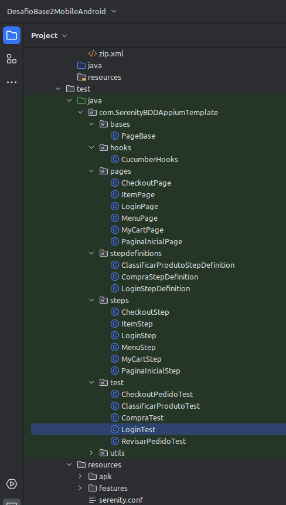
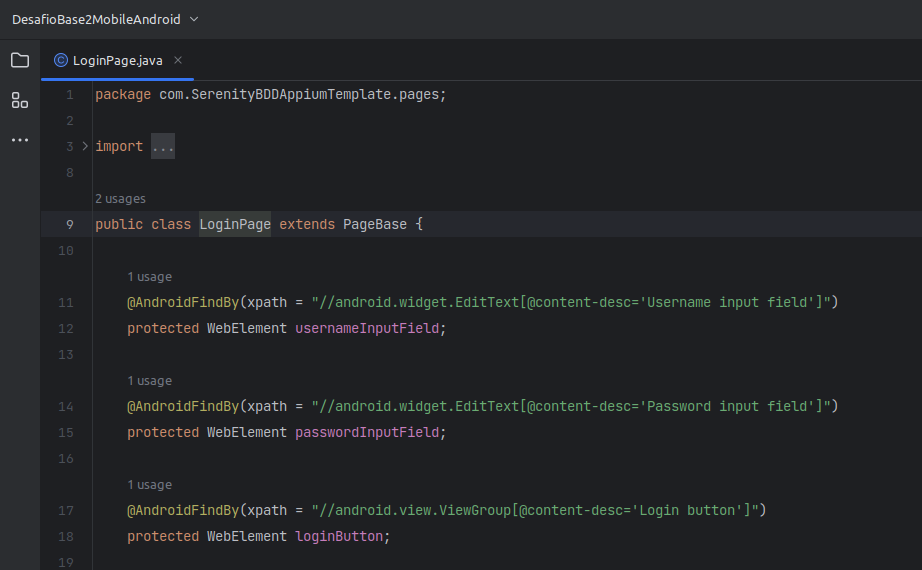
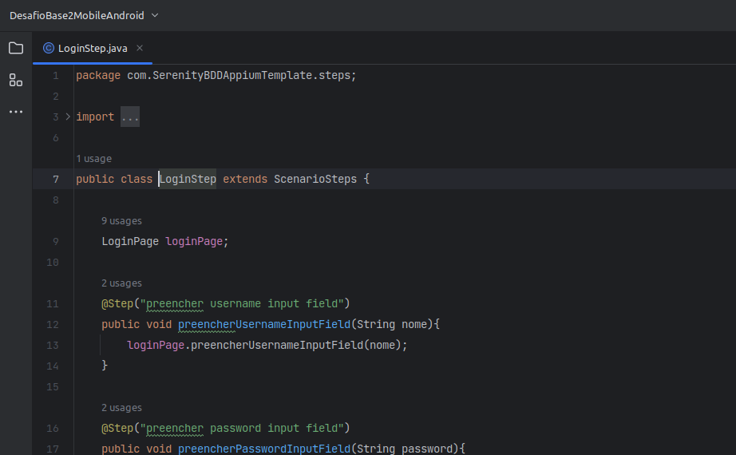
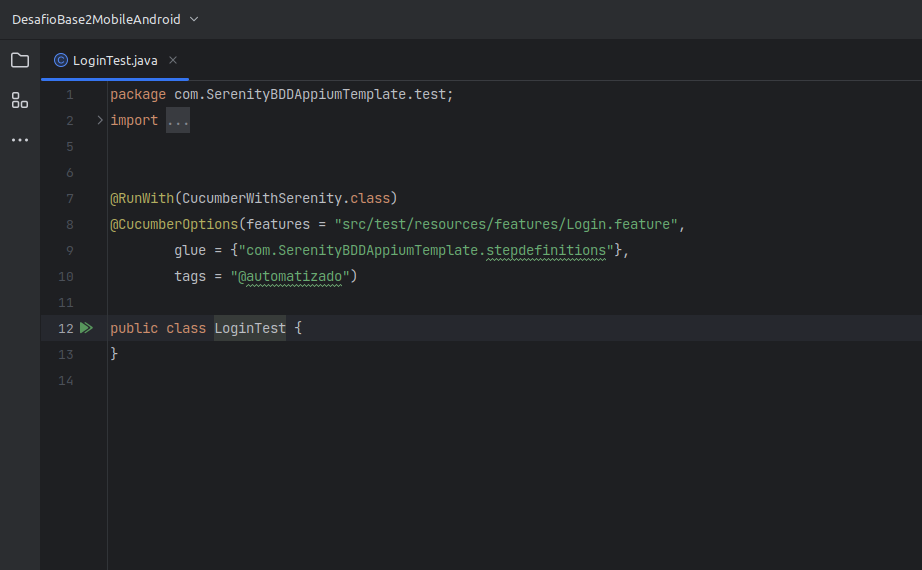
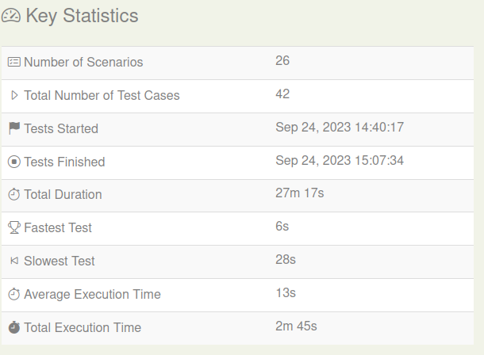
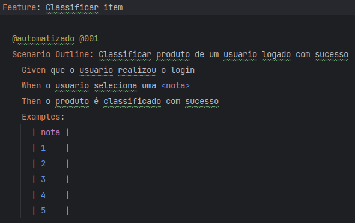
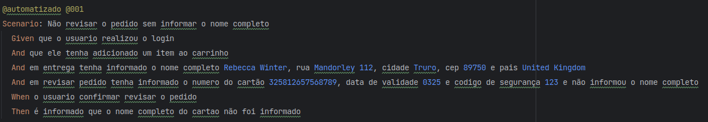
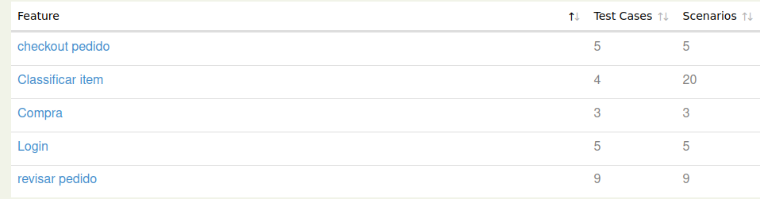
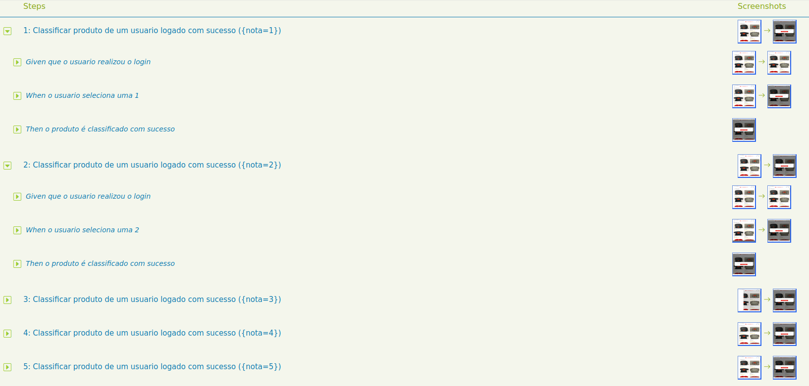

# Framework SerenityBDD, Cucumber, Selenium , Appium e Java de Teste Mobile. 

Este é um projeto de framework de teste de Mobile altamente eficiente, desenvolvido para simplificar e agilizar o processo de codificação de testes automatizados Mobile. Com base nas bibliotecas mais poderosas e populares do ecossistema Java para testes automatizados Mobile, este framework oferece uma estrutura robusta e flexível para a automação de testes de Mobile.


## Recursos Destacados

- **Java 8**: Linguagem de programação versátil, orientada a objetos e altamente portátil, com um vasto ecossistema de bibliotecas e ferramentas. É amplamente utilizado para o desenvolvimento de aplicativos empresariais, web e móveis devido à sua segurança, desempenho e facilidade de uso.
 ####
- **Cucumber**: Aproveite o poder do BDD (Behavior-Driven Development) com o Cucumber, uma biblioteca que permite escrever testes em uma linguagem de domínio específica (Gherkin) e executá-los em um formato legível para não desenvolvedores. Isso facilita a colaboração entre equipes técnicas e não técnicas.
 ####
- **Selenium 4**: O Selenium 4 é uma atualização do popular framework de automação de testes que oferece suporte a recursos aprimorados, como suporte nativo para o W3C WebDriver, suporte para automação de aplicações WEB mais intuitiva e simplificada.
 ####
- **Serenity BDD**: O SerenityBDD é um framework de automação de testes que oferece relatórios detalhados e legíveis e integração com BDD, permitindo uma abordagem orientada a comportamento nos testes automatizados.
 ####
- **JUnit 4**: Aproveite os recursos do JUnit 4, um framework de teste unitário amplamente utilizado para Java. Ele permite que você defina casos de teste individuais, organize-os em suítes de testes e execute-os com eficiência. O JUnit 4 também oferece recursos avançados, como anotações de configuração e assertivas poderosas.
 ####
- **Appium**: O Appium é uma plataforma de automação de código aberto para testes de aplicativos móveis em dispositivos Android e iOS. Ele oferece flexibilidade, suporte a várias linguagens de programação e a capacidade de testar em dispositivos reais, tornando-o uma escolha valiosa para garantir a qualidade de aplicativos móveis.
 ####
- **AWS Device Farm**: Um serviço da Amazon Web Services para testar aplicativos em dispositivos reais, Amplia a cobertura de testes em diversos dispositivos móveis.

## Arquitetura Page Object
   - **Padrão Page Object (PO)**: Um modelo de design para automação de testes que separa a lógica de interação com a página (Page) dos passos de teste (Step), mapeados pelos passos de definição (StepDefinitions), para facilitar a manutenção e reutilização de código.
   - <details>
      <summary>Implementação do padrão Page Object</summary>

     
   </details>

   - **Page**: Representa uma página ou componente da interface do usuário, encapsulando a lógica de interação com os elementos da página em métodos, promovendo a reutilização e a modularidade.
   - <details>
      <summary>Implementação do Page</summary>

      
   </details>

   - **Step**: Define ações e verificações em um cenário de teste, usando os métodos da classe Page para interagir com a interface do usuário, facilitando a legibilidade e a manutenção dos testes.
   - <details>
      <summary>Implementação do Step</summary>

      
   </details>

   - **StepDefinitions**: Mapeia os passos definidos em linguagem natural (Gherkin) para os métodos do Step, estabelecendo a conexão entre a especificação de teste e a implementação dos passos.
   - <details>
      <summary>Implementação do StepDefinitons</summary>

      
   </details>

   - **Test**: É a execução dos cenários de teste usando os passos de definição e os page objects, garantindo a automação dos fluxos de teste e a verificação dos resultados esperados.
   - <details>
      <summary>Implementação do Test</summary>

     
   </details>

## Configuração e Execução
    
### Pré-requisitos
### Hardware:
- Processador: Intel Core i7-7700HQ ou AMD Ryzen 5600G
- Memória RAM: 16 GB
- Armazenamento: 20GB de espaço livre
- Conectividade: Acesso à Internet estável

### Software:

#### S.O Ubuntu 22.04 : 
<details>
  <summary>Como instalar o Ubuntu 22.04</summary>

#### [site oficial do Ubuntu](https://ubuntu.com/tutorials/install-ubuntu-desktop#1-overview).
</details>

#### OpenJDK 1.8 :
<details>
  <summary>Como instalar o OpenJDK 1.8</summary>

#### [site oficial da Oracle](https://docs.oracle.com/javase/8/docs/technotes/guides/install/linux_jdk.html#install-archive).
</details>

#### Intellij Idea Community version 2023.1.2
<details>
  <summary>Como instalar o Intellij Idea Community version</summary>

#### [site oficial da JetBrains](https://www.jetbrains.com/help/idea/installation-guide.html#snap).
</details>

#### Nodejs :
<details>
  <summary>Como instalar o Nodejs</summary>

#### [site oficial do Nodejs](https://github.com/nvm-sh/nvm).
</details>


#### Appium :
<details>
  <summary>Como instalar o Appium</summary>

#### [site oficial do Appium](http://appium.io/docs/en/2.0/).
</details>

#### Appium Inspector :
<details>
  <summary>Como instalar o Appium Inspector</summary>

#### [site oficial do Appium Inspector](https://github.com/appium/appium-inspector).
</details>


#### Usuario root no Ubuntu


## Desafios Base 2

### Teste automatizado de API da aplicação MantisBT

##### - [✔] Tarefa concluída

##### - [x] Tarefas pendentes

### 1. [✔] Implementar 25 algoritmos de testes que manipulem um aplicativo móvel Android com Page Objects.
Implementado Framework no padrão Page Object com 26 testes unicos.
<details>
  <summary>Resultados dos teste.</summary>


</details>

#### A Arquitetura do framework segue o padrão Page Object 
Padrão Page Object (PO): Um modelo de design para automação de testes que separa a lógica de interação com a página (Page) dos passos de teste (Step), mapeados pelos passos de definição (StepDefinitions), para facilitar a manutenção e reutilização de código.
<details>
  <summary>Implementação do padrão Page Object</summary>

  
</details>

Page: Representa uma página ou componente da interface do usuário, encapsulando a lógica de interação com os elementos da página em métodos, promovendo a reutilização e a modularidade.
<details>
   <summary>Implementação do Page</summary>

  
</details>

Step: Define ações e verificações em um cenário de teste, usando os métodos da classe Page para interagir com a interface do usuário, facilitando a legibilidade e a manutenção dos testes.
<details>
  <summary>Implementação do Step</summary>


</details>

StepDefinitions: Mapeia os passos definidos em linguagem natural (Gherkin) para os métodos do Step, estabelecendo a conexão entre a especificação de teste e a implementação dos passos.
<details>
  <summary>Implementação do StepDefinitons</summary>


</details>

Test: É a execução dos cenários de teste usando os passos de definição e os page objects, garantindo a automação dos fluxos de teste e a verificação dos resultados esperados.
<details>
  <summary>Implementação do Test</summary>


</details>

##### Mais de 25 algoritmos de testes unicos de WEB implementados.


### 2. [✔] Alguns algoritmos de testes devem ler dados para implementar Data-Driven. 

   ##### Implementação de Data-Driven pelo Cucumber.

<details>
  <summary>Exemplo 1</summary>s
   

</details>
<details>
  <summary>Exemplo 2</summary>


</details>


### 3. [✔] Notem que 25 algoritmos de testes podem cobrir mais de 25 casos de testes se usarmos Data-Driven. Em outras palavras, implementar 25 CTs usando data-driven não é a mesma coisa que implementar 25 algoritmos de testes. </summary>

   ##### Mais de 25 casos de testes unicos implementados com um total de 46 utilizando Data Driven.
<details>
  <summary>Quantidade de testes</summary>


</details>

### 4. [✔] Os casos de testes precisam ser executados em simulador e em um device real.
Os Testes foram executados nos dois devices.
####
Dispositivo Emulador = Pixel 4 XL.
####
Dispositivo real = Galaxy S10 Note+.
####
Dispositivo real aws device farm = Pixel 4 XL.
 

### 5. [✔] Implementar 25 scripts de testes que manipulem um aplicativo móvel iOS com Page Objects.
    
   
<details>
  <summary>Exemplo do Relatorio com foto.</summary>


</details>

#### É possivel acompanhar os testes em tempo real de execução, e se necessario é possivel habilitar a gravação de videos no Selenium Grid 4.
<details>
  <summary>Visualizando o teste em execução.</summary>


</details>

### 6. Alguns algoritmos de testes devem ler dados para implementar Data-Driven.
##### Implementação de Data-Driven pelo Cucumber.

<details>
  <summary>Exemplo 1</summary>s


</details>
<details>
  <summary>Exemplo 2</summary>


</details>

#### É possivel acompanhar os testes em tempo real de execução, e se necessario é possivel habilitar a gravação de videos no Selenium Grid 4.

### 7. [✔] Notem que 25 algoritmos de testes podem cobrir mais de 25 casos de testes se usarmos Data-Driven. Em outras palavras, implementar 25 CTs usando data-driven não é a mesma coisa que implementar 25 algoritmos de testes. </summary>

##### Mais de 25 casos de testes unicos implementados com um total de 46 utilizando Data Driven.
<details>
  <summary>Quantidade de testes</summary>


</details>

### 8. [✔] Os casos de testes precisam ser executados em simulador e em um device real.
Os Testes foram executados nos dois devices.
####
Dispositivo Emulador = iPhone 14 Pro.
####
Dispositivo real = iPhone 12.
####
Dispositivo real aws device farm = iPhone 14 Pro.
Não foi possivel gerar evidencias e realizar os teste no device real. 
####
dado que é necessario ter um conta de developer da apple no valor $100,00 dolares para poder assinar o aplicativo a ser testado.
#### [site oficial do developer apple](https://developer.apple.com/pt/support/compare-memberships/).
Mesmo assim foi possivel executar os teste em um dispositivo real na aws device farm e gerar as evidencias de que os testes não foram executados pela falta da assinatura no arquivo .ipa.  
<details>
  <summary>Codigo de erro do arquivo 5e95e42d-41f3-487d-bcf8-37b9d11c4e51.txt Inicio linha 29465</summary>
        
```

29465 Prepare packages
29466 Computing target dependency graph and provisioning inputs
29467 Create build description
29468 Build description signature: 455c4ff3cddec3fdcd31d5a4148faff5
29469 Build description path: /Users/device-farm/Library/Developer/Xcode/DerivedData/WebDriverAgent-ezgzzvauxrwwusbiqjpzuofsdkbi/Build/Intermediates.noindex/XCBuildData/455c4ff3cddec3fdcd31d5a4148faff5-desc.xcbuild
29470 note: Building targets in dependency order
29471 /usr/local/avm/versions/1.22.2/node_modules/appium/node_modules/appium-webdriveragent/WebDriverAgent.xcodeproj: error: Signing for "WebDriverAgentRunner" requires a development team. Select a development team in the Signing & Capabilities editor. (in target 'WebDriverAgentRunner' from project 'WebDriverAgent')
29472 ** TEST BUILD FAILED **
29473 2023-10-01 16:30:49.409 xcodebuild[1519:7697] [MT] IDETestOperationsObserverDebug: 0.014 elapsed -- Testing started completed.
29475 2023-10-01 16:30:49.409 xcodebuild[1519:7697] [MT] IDETestOperationsObserverDebug: 0.000 sec, +0.000 sec -- start
29476 2023-10-01 16:30:49.409 xcodebuild[1519:7697] [MT] IDETestOperationsObserverDebug: 0.014 sec, +0.014 sec -- end
29477 Test session results, code coverage, and logs:
29478 /Users/device-farm/Library/Developer/Xcode/DerivedData/WebDriverAgent-ezgzzvauxrwwusbiqjpzuofsdkbi/Logs/Test/Test-WebDriverAgentRunner-2023.10.01_16-30-48--0700.xcresult
29479 Testing failed:
29480 Signing for "WebDriverAgentRunner" requires a development team. Select a development team in the Signing & Capabilities editor.
29481 Test target WebDriverAgentRunner encountered an error (The bundle identifier for WebDriverAgentRunner-Runner.app couldn’t be read. No such file or directory: “/Users/device-farm/Library/Developer/Xcode/DerivedData/WebDriverAgent-ezgzzvauxrwwusbiqjpzuofsdkbi/Build/Products/Debug-iphoneos/WebDriverAgentRunner-Runner.app”.)
29482 ** TEST EXECUTE FAILED **


```

</details>


### - 9. [✔] Gravar screenshots ou vídeos automaticamente dos casos de testes.
#### O Framework possui a implementação de foto no relatorio e os relatorios foram gerados com fotos.
<details>
  <summary>Exemplo do relatorio</summary>


</details>

#### Foram gerados videos da execução dos testes na aws device farm do android e do ios.

### - 10. [✔] O projeto deverá gerar um relatório de testes automaticamente com screenshots ou vídeos.
#### Projeto utiliza o SerenityBDD para gerar um relatorio automaticamente podendo realizar os screenshots durante a execução dos testes.

### - 11. [✔] Executar os testes em uma device farm.
#### Os teste foram executados no AWS device farm com dispositivos reais.