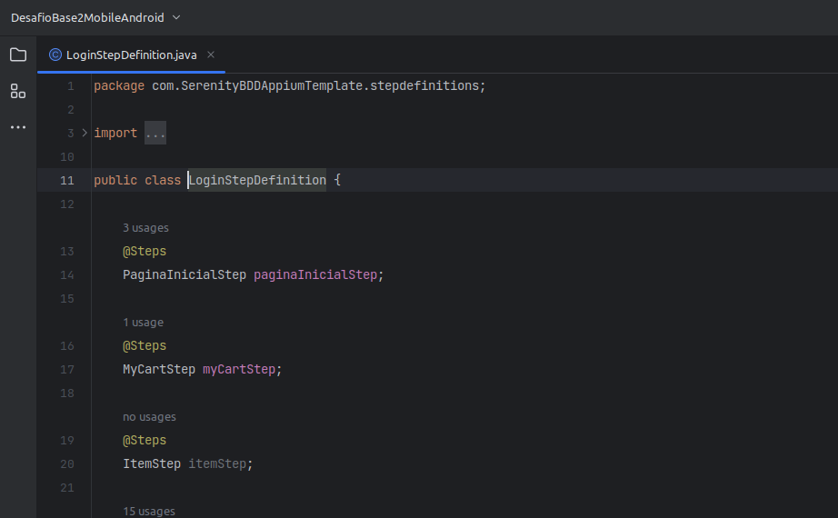
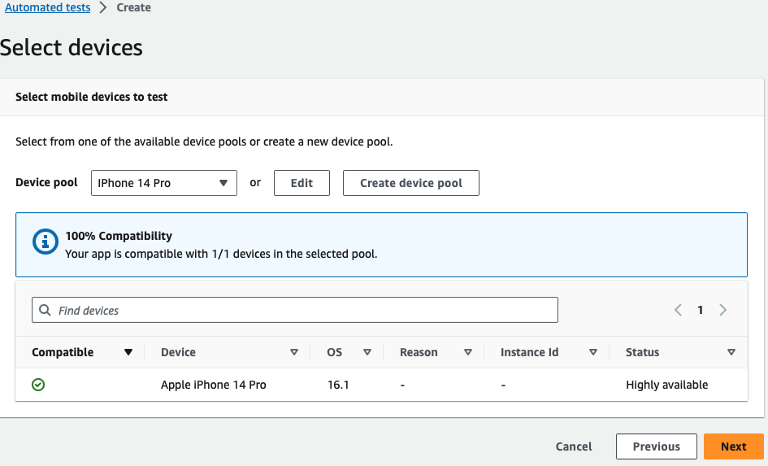
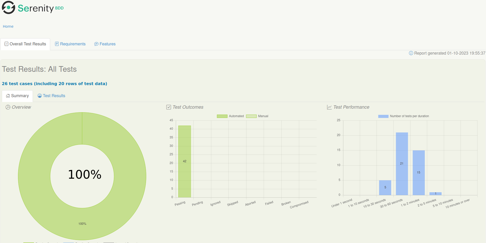

# Framework SerenityBDD, Cucumber, Selenium , Appium e Java de Teste Mobile.

Este é um projeto de framework de teste de Mobile altamente eficiente, desenvolvido para simplificar e agilizar o processo de codificação de testes automatizados Mobile. Com base nas bibliotecas mais poderosas e populares do ecossistema Java para testes automatizados Mobile, este framework oferece uma estrutura robusta e flexível para a automação de testes de Mobile.


## Recursos Destacados

- **Java 8**: Linguagem de programação versátil, orientada a objetos e altamente portátil, com um vasto ecossistema de bibliotecas e ferramentas. É amplamente utilizado para o desenvolvimento de aplicativos empresariais, web e móveis devido à sua segurança, desempenho e facilidade de uso.
####
- **Cucumber**: Aproveite o poder do BDD (Behavior-Driven Development) com o Cucumber, uma biblioteca que permite escrever testes em uma linguagem de domínio específica (Gherkin) e executá-los em um formato legível para não desenvolvedores. Isso facilita a colaboração entre equipes técnicas e não técnicas.
####
- **Selenium 4**: O Selenium 4 é uma atualização do popular framework de automação de testes que oferece suporte a recursos aprimorados, como suporte nativo para o W3C WebDriver, suporte para automação de aplicações WEB mais intuitiva e simplificada.
####
- **Serenity BDD**: O SerenityBDD é um framework de automação de testes que oferece relatórios detalhados e legíveis e integração com BDD, permitindo uma abordagem orientada a comportamento nos testes automatizados.
####
- **JUnit 4**: Aproveite os recursos do JUnit 4, um framework de teste unitário amplamente utilizado para Java. Ele permite que você defina casos de teste individuais, organize-os em suítes de testes e execute-os com eficiência. O JUnit 4 também oferece recursos avançados, como anotações de configuração e assertivas poderosas.
####
- **Appium**: O Appium é uma plataforma de automação de código aberto para testes de aplicativos móveis em dispositivos Android e iOS. Ele oferece flexibilidade, suporte a várias linguagens de programação e a capacidade de testar em dispositivos reais, tornando-o uma escolha valiosa para garantir a qualidade de aplicativos móveis.
####
- **AWS Device Farm**: Um serviço da Amazon Web Services para testar aplicativos em dispositivos reais, Amplia a cobertura de testes em diversos dispositivos móveis.

## Arquitetura Page Object
- **Padrão Page Object (PO)**: Um modelo de design para automação de testes que separa a lógica de interação com a página (Page) dos passos de teste (Step), mapeados pelos passos de definição (StepDefinitions), para facilitar a manutenção e reutilização de código.
- <details>
   <summary>Implementação do padrão Page Object</summary>

  
   </details>

- **Page**: Representa uma página ou componente da interface do usuário, encapsulando a lógica de interação com os elementos da página em métodos, promovendo a reutilização e a modularidade.
- <details>
   <summary>Implementação do Page</summary>

  
   </details>

- **Step**: Define ações e verificações em um cenário de teste, usando os métodos da classe Page para interagir com a interface do usuário, facilitando a legibilidade e a manutenção dos testes.
- <details>
   <summary>Implementação do Step</summary>

  
   </details>

- **StepDefinitions**: Mapeia os passos definidos em linguagem natural (Gherkin) para os métodos do Step, estabelecendo a conexão entre a especificação de teste e a implementação dos passos.
- <details>
   <summary>Implementação do StepDefinitons</summary>

  
   </details>

- **Test**: É a execução dos cenários de teste usando os passos de definição e os page objects, garantindo a automação dos fluxos de teste e a verificação dos resultados esperados.
- <details>
   <summary>Implementação do Test</summary>

  
   </details>

## Configuração e Execução

### Pré-requisitos
### Hardware:
- Processador: AMD Ryzen 2700X
- Memória RAM: 32 GB
- Palca de video Radeon RX 580 Red Devil 8GB
- Armazenamento: 20GB de espaço livre
- Conectividade: Acesso à Internet estável

### Software:

#### S.O MacOS Ventura :
<details>
  <summary>Como instalar o MacOS Ventura </summary>

#### [site oficial OpenCore](https://dortania.github.io/OpenCore-Install-Guide/).
</details>

#### OpenJDK 1.8 :
<details>
  <summary>Como instalar o OpenJDK 1.8</summary>

#### [site oficial da Oracle](https://docs.oracle.com/javase/8/docs/technotes/guides/install/linux_jdk.html#install-archive).
</details>

#### Nodejs :
<details>
  <summary>Como instalar o Nodejs</summary>

#### [site oficial do Nodejs](https://github.com/nvm-sh/nvm).
</details>

#### Appium :
<details>
  <summary>Como instalar o Appium</summary>

#### [site oficial do Appium](http://appium.io/docs/en/2.0/).
</details>

#### Appium Inspector :
<details>
  <summary>Como instalar o Appium Inspector</summary>

#### [site oficial do Appium Inspector](https://github.com/appium/appium-inspector).
</details>

#### Xcode ide:
<details>
  <summary>Como instalar o xcode</summary>

#### [site oficial do developer apple](https://developer.apple.com/documentation/xcode).
</details>

#### Instalar o emulador do iphone :
<details>
  <summary>Como instalar o modo desenvolverdor iphone</summary>

#### [site oficial do developer apple](https://developer.apple.com/documentation/xcode/installing-additional-simulator-runtimes).
</details>

#### Modo desenvolvedor habilitado dispositivo iphone :
<details>
  <summary>Como instalar o modo desenvolverdor iphone</summary>

#### [site oficial do developer apple](https://developer.apple.com/documentation/xcode/enabling-developer-mode-on-a-device).
</details>


## Como executar o teste no aws device farm

<details>
  <summary>AWS device farm</summary>

##### Este é um passo a passo de como configurar um projeto no Framework Serenity BDD Mobile localmente para gerar o artefato de teste, como sua configuração e execução no aws device farm e como realizar o download do artefato gerado pela execução do teste.
##### Neste Documento é considerado que o leitor já tenha familiaridade com o desenvolvimento de testes e suas atividades, já esteja na fase de execução do projeto, não será abordado como instalar e configurar ferramentas de uso ao desenvolvimento de testes automatizados, tais como maven, IDE, java, appium etc.
####
### Configurando o serenity.yml
#### Este arquivo é responsavel pela configuração, instalação e execução dos testes no device farm.
#### Verifique a linha 146 ela deve conter o nome do projeto.
#### Exemplo: NomeDoSeuProjeto/pom.xml .
#### Estamos passando o comando de execução do teste para o mvn junto das capabilites do dispositivo que sera utilizado no teste.
#### Os valores referentes as capabilities são retornados atraves de variaveis disponibilizadas pelo device farm.
#### Se voce precisar executar uma tag diferente de automatizado mude o valor da variavel -Dcucumber.filter.tags="@SuaTagAqui".
#### Pode ser necessario adicionar estas capabilities “appium:bundleId”: “com.app.laymui.stockprice”, “appium:xcodeOrgId”: “Seu nome aqui”, “appium:xcodeSigningId”: “iPhone Developer”
````
      - mvn -f DesafioBase2MobileIOS/pom.xml clean verify -Dwebdriver.driver=appium -Dcucumber.filter.tags="@automatizado" -Dappium.automationName=$PLATFORMNAME -Denvironment=staging -Dappium.screenshots.dir=$DEVICEFARM_SCREENSHOT_PATH -Dappium.autoAcceptAlerts=true -Dappium.autoGrantPermissions=true -Dappium.platformName=$DEVICEFARM_DEVICE_PLATFORM_NAME -Dappium.app=$DEVICEFARM_APP_PATH -Dappium.udid=$DEVICEFARM_DEVICE_UDID_FOR_APPIUM
         
````

###
#### Verifique a linha 147 ela deve conter o nome do projeto junto a pasta em que sera gerado o relatorio.
#### Exemplo: NomeDoSeuProjeto/target/site .
#### Este comando é responsavel por criar a pasta em que o nosso relatorio sera criado.
````
- cp -Rv DesafioBase2MobileIOS/target/site $DEVICEFARM_LOG_DIR
````

###
#### Verifique a linha 160 ela deve conter o caminho da pasta em que sera gerado o relatorio durante o teste.
#### Exemplo: $DEVICEFARM_LOG_DIR/DesafioBase2MobileIOS/target/site .
#### Este comando é responsavel por disponibilizar o nosso relatorio para download apos a execução.
````
- $DEVICEFARM_LOG_DIR/DesafioBase2MobileIOS/target/site
````
###
### Configurando o zip.xml
#### Este arquivo é responsavel por criar a estrutura necessaria do nosso arquivo zip-with-dependencies.zip .
###
#### Verifique a linha 32 ela deve conter o nome do diretorio principal do seu projeto antecedendo ./
````
<outputDirectory>./DesafioBase2MobileIOS</outputDirectory>
````
###
#### Verifique a linha 40 ela deve conter o nome do diretorio principal do seu projeto antecedendo ./ seguido de /src
````
<outputDirectory>./DesafioBase2MobileIOS/src</outputDirectory>
````
###
### Gerando o artefato de teste localmente
###

####  abra o terminal do Intellij execute o comando mvn clean.


###

####  digite e execute o comando mvn clean package -DskipTests="true" .


###

#### O artefato de teste foi gerado com sucesso.


###
#### O artefato esta disponivel em DesafioBase2MobileIOS/target/zip-with-dependencies.zip


###

### Executando sua aplicação de teste no aws device farm
####
#### Em Device Farm selecione new project.

####
#### Informe o nome do seu projeto e selecione create.

####
#### Selecione create a new run.

####
#### Selecione Choose file, selecione o aplicativo a ser testado, aguarde o upload e selecione next .

####
#### Clique em Built-in:Fuzz selecione Appium Java TestNG.

####
#### Selecione Choose file, selecione o zip-with-dependencies.zip, aguarde o upload .

####
#### Selecione Edit.

####
#### Delete o texto original do arquivo YAML, copie e cole o conteudo do arquivo serenity.yml do projeto, digite um nome em Saves as, clique em Save as New.

####
#### Selecione Next.

####
#### Select Create device pool.

####
#### Informe um nome, selecione Cretive static device pool, selecione o celular, selecione Create.

####
#### Selecione Next.

####
#### Selecione Next.

####
#### Confira se esta tudo ok e selecione Confirm and start run.

####
#### Selecione em name o seu aplicativo.

####
#### Selecione em name o seu aplicativo.

####
#### Pronto nossos teste ja estão sendo executados.

####
#### Ao termino sera apresentada a seguinte tela .

####
#### Para fazer o download do relatorio clique em Files, em Tests Suite selecione Customer Artifacts.

####
#### O Download do artefato de teste será iniciado, após o download descompacte o arquivo, e navegue até a pasta Host_Machine_Files\$DEVICEFARM_LOG_DIR\site\serenity\index.html .

####
#### Pronto Teste finalizdo com sucesso !


</details>


## Como executar o teste do IOS localmente em dispositivo real ou emulado

<details>
  <summary>executando o teste local</summary>

####
#### Configurar um dispositivo real
#### Plugue o cabo usb no seu dispositivo conecte a outra ponta do cabo no entrada USB do seu computador.
#### No seu dispositivo acesse Ajustes > Privacidade e Segurança > Modo de Desenvolvimento, informe sua e selecione reiniciar, apos reiniciar selecione ativar.
#### No seu dispositivo acesse Configurações > Opções do desenvolvedor verifique se esta ativado.
#### para verificar as informações necessarias do aparelho, abra o xcode selecione Windows > devices and simulator.  
####
#### Ou inicie o emulador do ios.
####
### Iniciando a execução
#### Abra um terminal e inicie o appium


###
#### No projeto acesse serenity.properties, informe os dados do dispositivo real ou emulado em que o teste sera executado.
#### appium.platformVersion = Versão do Android
#### appium.deviceName  = Nome do dispositivo


####
###
#### No terminal do IDE digite o comando mvn clean verify "-Dcucumber.filter.tags=@automatizado"

###
#### Com isso nossos testes ja estaram sendo executados.

####
###
#### no final dos testes sera gerado o nosso relatorio.

####
###
#### No projeto acesse target/site/serenity/index.html .


</details>


## Desafio Base 2 Mobile

<details>
  <summary>Desafios Propostos</summary>

#### Teste automatizado de Mobile da aplicação MyDemoApp

##### - [✔] Tarefa concluída

##### - [x] Tarefas pendentes

### 1. [✔] Implementar 25 scripts de testes que manipulem um aplicativo móvel iOS com Page Objects.
Implementado Framework no padrão Page Object com 26 testes unicos.
<details>
  <summary>Resultados dos teste.</summary>


</details>

#### A Arquitetura do framework segue o padrão Page Object
Padrão Page Object (PO): Um modelo de design para automação de testes que separa a lógica de interação com a página (Page) dos passos de teste (Step), mapeados pelos passos de definição (StepDefinitions), para facilitar a manutenção e reutilização de código.
<details>
  <summary>Implementação do padrão Page Object</summary>


</details>

Page: Representa uma página ou componente da interface do usuário, encapsulando a lógica de interação com os elementos da página em métodos, promovendo a reutilização e a modularidade.
<details>
   <summary>Implementação do Page</summary>


</details>

Step: Define ações e verificações em um cenário de teste, usando os métodos da classe Page para interagir com a interface do usuário, facilitando a legibilidade e a manutenção dos testes.
<details>
  <summary>Implementação do Step</summary>


</details>

StepDefinitions: Mapeia os passos definidos em linguagem natural (Gherkin) para os métodos do Step, estabelecendo a conexão entre a especificação de teste e a implementação dos passos.
<details>
  <summary>Implementação do StepDefinitons</summary>


</details>

Test: É a execução dos cenários de teste usando os passos de definição e os page objects, garantindo a automação dos fluxos de teste e a verificação dos resultados esperados.
<details>
  <summary>Implementação do Test</summary>


</details>

##### Mais de 25 algoritmos de testes unicos de WEB implementados.


### 2. [✔] Alguns algoritmos de testes devem ler dados para implementar Data-Driven.

##### Implementação de Data-Driven pelo Cucumber.

<details>
  <summary>Exemplo 1</summary>s


</details>
<details>
  <summary>Exemplo 2</summary>


</details>


### 3. [✔] Notem que 25 algoritmos de testes podem cobrir mais de 25 casos de testes se usarmos Data-Driven. Em outras palavras, implementar 25 CTs usando data-driven não é a mesma coisa que implementar 25 algoritmos de testes. </summary>

##### Mais de 25 casos de testes unicos implementados com um total de 46 utilizando Data Driven.
<details>
  <summary>Quantidade de testes</summary>


</details>

### 4. [✔] Os casos de testes precisam ser executados em simulador e em um device real.
Os Testes foram executados nos dois devices.
####
Dispositivo Emulador = iPhone 14 Pro.
####
Dispositivo real = iPhone 12.
####
Dispositivo real aws device farm = iPhone 14 Pro.
Os testes foram executados mais falharam por falta do arquivo .ipa ser assinado, foi possivel gerar evidencias de que os testes não foram executados por falta da licença.
dado que é necessario ter um conta de developer da apple no valor $100,00 dolares para poder assinar o aplicativo a ser testado.
#### [site oficial do developer apple](https://developer.apple.com/pt/support/compare-memberships/).
<details>
  <summary>Codigo de erro do arquivo 5e95e42d-41f3-487d-bcf8-37b9d11c4e51.txt Inicio linha 29465</summary>

```

29465 Prepare packages
29466 Computing target dependency graph and provisioning inputs
29467 Create build description
29468 Build description signature: 455c4ff3cddec3fdcd31d5a4148faff5
29469 Build description path: /Users/device-farm/Library/Developer/Xcode/DerivedData/WebDriverAgent-ezgzzvauxrwwusbiqjpzuofsdkbi/Build/Intermediates.noindex/XCBuildData/455c4ff3cddec3fdcd31d5a4148faff5-desc.xcbuild
29470 note: Building targets in dependency order
29471 /usr/local/avm/versions/1.22.2/node_modules/appium/node_modules/appium-webdriveragent/WebDriverAgent.xcodeproj: error: Signing for "WebDriverAgentRunner" requires a development team. Select a development team in the Signing & Capabilities editor. (in target 'WebDriverAgentRunner' from project 'WebDriverAgent')
29472 ** TEST BUILD FAILED **
29473 2023-10-01 16:30:49.409 xcodebuild[1519:7697] [MT] IDETestOperationsObserverDebug: 0.014 elapsed -- Testing started completed.
29475 2023-10-01 16:30:49.409 xcodebuild[1519:7697] [MT] IDETestOperationsObserverDebug: 0.000 sec, +0.000 sec -- start
29476 2023-10-01 16:30:49.409 xcodebuild[1519:7697] [MT] IDETestOperationsObserverDebug: 0.014 sec, +0.014 sec -- end
29477 Test session results, code coverage, and logs:
29478 /Users/device-farm/Library/Developer/Xcode/DerivedData/WebDriverAgent-ezgzzvauxrwwusbiqjpzuofsdkbi/Logs/Test/Test-WebDriverAgentRunner-2023.10.01_16-30-48--0700.xcresult
29479 Testing failed:
29480 Signing for "WebDriverAgentRunner" requires a development team. Select a development team in the Signing & Capabilities editor.
29481 Test target WebDriverAgentRunner encountered an error (The bundle identifier for WebDriverAgentRunner-Runner.app couldn’t be read. No such file or directory: “/Users/device-farm/Library/Developer/Xcode/DerivedData/WebDriverAgent-ezgzzvauxrwwusbiqjpzuofsdkbi/Build/Products/Debug-iphoneos/WebDriverAgentRunner-Runner.app”.)
29482 ** TEST EXECUTE FAILED **


```

</details>

### - 5. [✔] Gravar screenshots ou vídeos automaticamente dos casos de testes.
#### O Framework possui a implementação de foto no relatorio e os relatorios foram gerados com fotos.
<details>
  <summary>Exemplo do relatorio</summary>


</details>

#### Foram gerados videos da execução dos testes na aws device farm do android e do ios.

### - 6. [✔] O projeto deverá gerar um relatório de testes automaticamente com screenshots ou vídeos.
#### Projeto utiliza o SerenityBDD para gerar um relatorio automaticamente podendo realizar os screenshots durante a execução dos testes.

### - 7. [✔] Executar os testes em uma device farm.
#### Os teste foram executados no AWS device farm com dispositivos reais.


</details>
